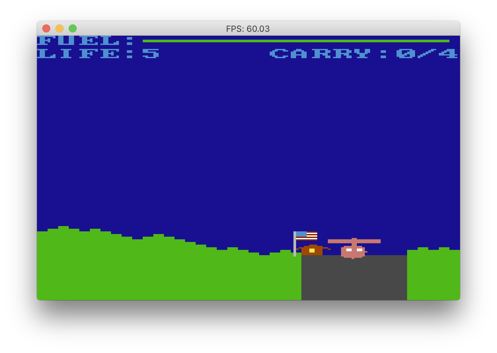
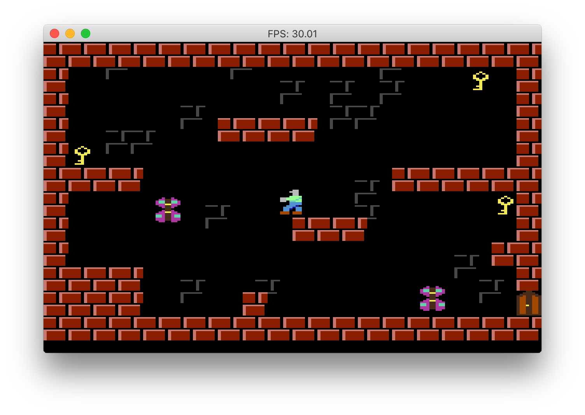
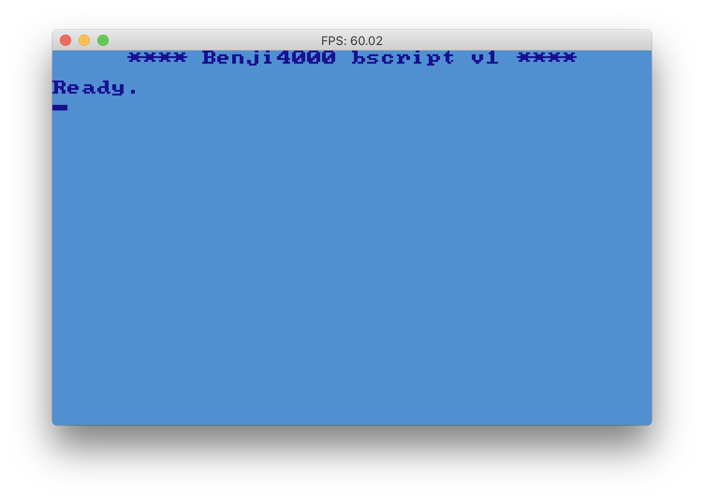

# benji4000
The "other" lost personal computer of the 80s. 
It was similar to the better known C64 but programmed in a higher-level (and much more imaginary) language.

 

# To build the code
`go build`

# Interpreter mode
`./benji4000`

# To run a bscript file

For example:
`./benji4000 -source=src/games/airwolf.b`

# bscript
The programming language of benji. Execution starts by calling the function named "main".

Bscript features higher order functions, control flow commands, global variables and constants, etc. 

Browse the [tests](https://github.com/gabor-lbl/benji4000/tree/master/src/tests) for examples or see the [wiki](https://github.com/uzudil/benji4000/wiki) for more info.

## bscript syntax highlighting
The vscode directory contains a plugin for syntax highlighting for .b files.
