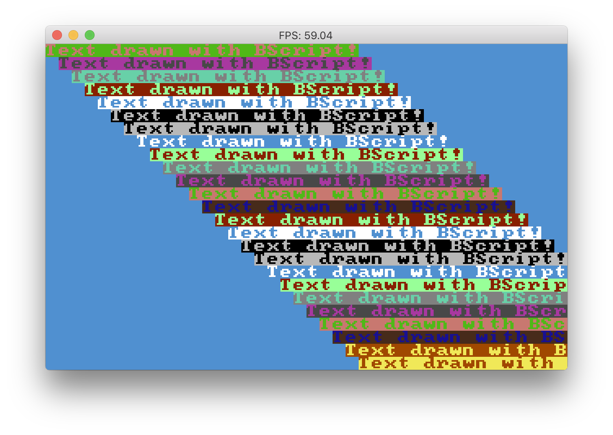

# benji4000
The "other" lost personal computer of the 80s. 
It was similar to the better known C64 but programmed in a higher-level (and much more imaginary) language.

# To build the code
`go build`

# Interpreter mode
`./benji4000`

# To run a bscript file

For example:
`./benji4000 -source=src/games/airwolf.b`

# bscript
The programming language of benji. Execution starts by calling the function named "main".

Bscript features higher order functions, anonymous functions, global variables and constants, etc. 

Browse the [tests](https://github.com/gabor-lbl/benji4000/tree/master/src/tests) for examples.

# video
The benji4000 personal computer was ahead of its time, featuring 3 graphics modes:

Text mode - a 40x25 16 color text mode: 

HiRes mode - graphics mode: 320x200 16 color mode where color is either background or the same for each 8x8 pixel region

Extended Color mode - 160x200 16 color mode where every pixel is double wide - excellent for games! 

- draw graphics primitives (point, line, circle, rectange) in pixel modes
- draw text in all modes
- per-pixel smooth scroll in all modes
- native sprite support (coming soon)

# sound
Coming soon!

## bscript syntax highlighting
The vscode directory contains a plugin for syntax highlighting for .b files.
  
